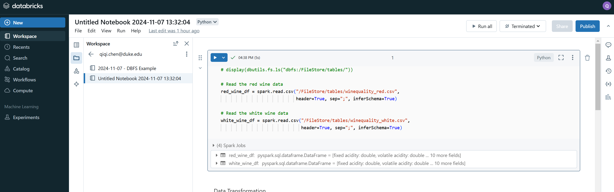
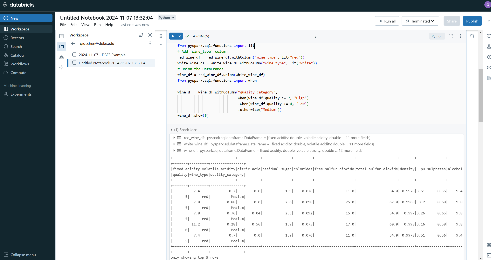
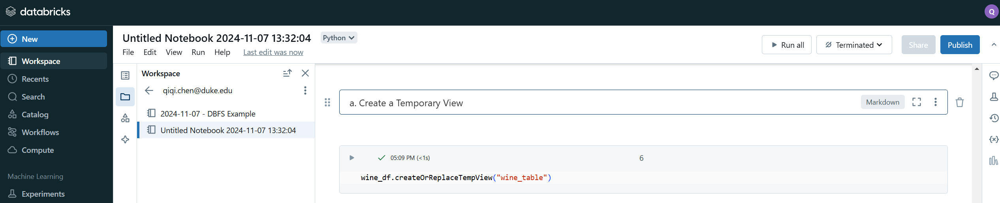
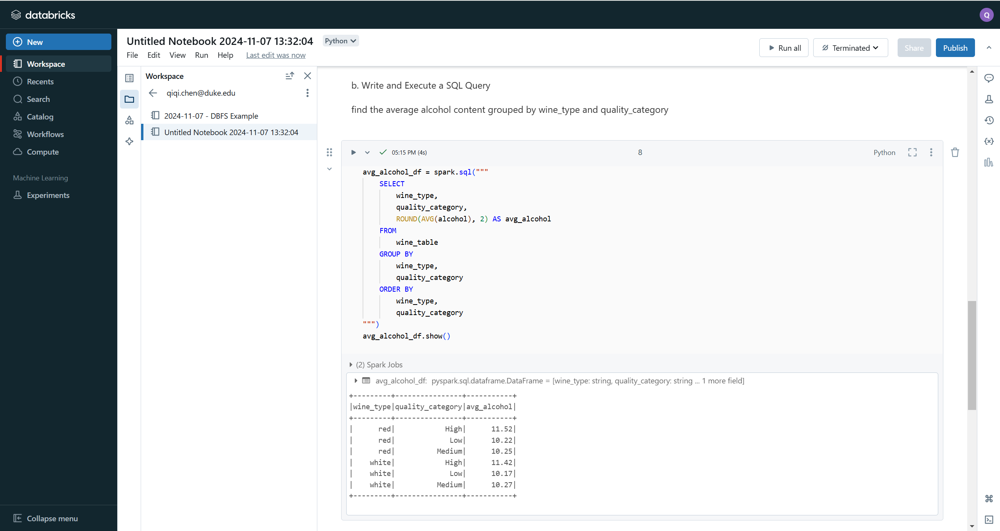
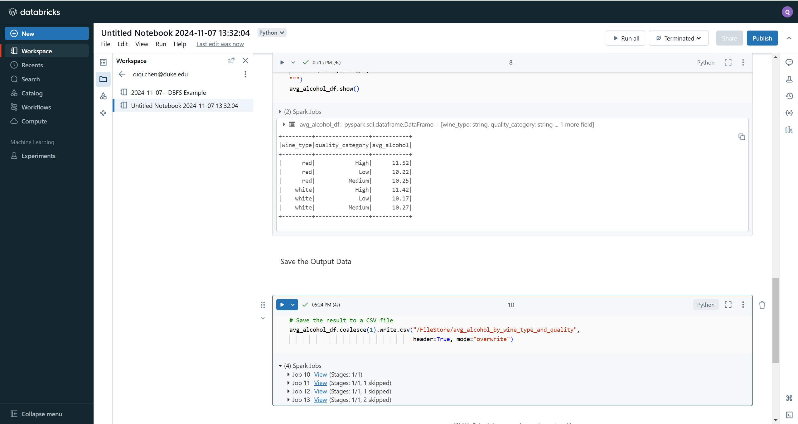

# PySpark Wine Quality Analysis

## Overview

This project performs data processing on the [Wine Quality dataset](https://archive.ics.uci.edu/ml/datasets/Wine+Quality) using PySpark. The analysis includes data transformations and Spark SQL queries to derive insights about wine quality based on physicochemical tests.

## Dataset

The dataset consists of red and white wine samples from the Portuguese "Vinho Verde" wine. It includes objective tests (e.g., pH values) and subjective quality ratings.

- **Features:**
  - Fixed acidity
  - Volatile acidity
  - Citric acid
  - Residual sugar
  - Chlorides
  - Free sulfur dioxide
  - Total sulfur dioxide
  - Density
  - pH
  - Sulphates
  - Alcohol
- **Target:**
  - Quality (score between 0 and 10)

## Installation

### Prerequisites

- Python 3.8 or higher
- Java JDK 8 or 11
- PySpark 3.3.0
- Git

### Steps

1. **Clone the Repository**

   ```bash
   git clone https://github.com/yourusername/your-repo-name.git
   cd your-repo-name

2. **Install Dependencies**

   ```bash
   pip install -r requirements.txt

3. **Download the Dataset**

   Download the dataset files:

    winequality-red.csv

    winequality-white.csv

4. **Run the PySpark Script**

    ```bash
   python wine_quality_analysis.py


### Usage
The script performs the following:

- Loads the red and white wine datasets into Spark DataFrames.
- Adds wine_type and quality_category columns.
- Combines the datasets into one DataFrame.
- Executes a Spark SQL query to find average alcohol content grouped by wine_type and quality_category.
- Saves the results to the output/ directory.

### Data processing functionality



### Use of Spark SQL and transformations




### CI/CD Pipeline
The project uses GitHub Actions for Continuous Integration.
[](https://github.com/iikikk/pyspark_data_processing/actions/workflows/ci.yml)

Pipeline Stages

- Build:

Installs Python dependencies from requirements.txt.

- Lint

Uses flake8 to ensure code quality and adherence to PEP 8 standards.

- Test

Runs unit tests using pytest to verify the correctness of transformations.

